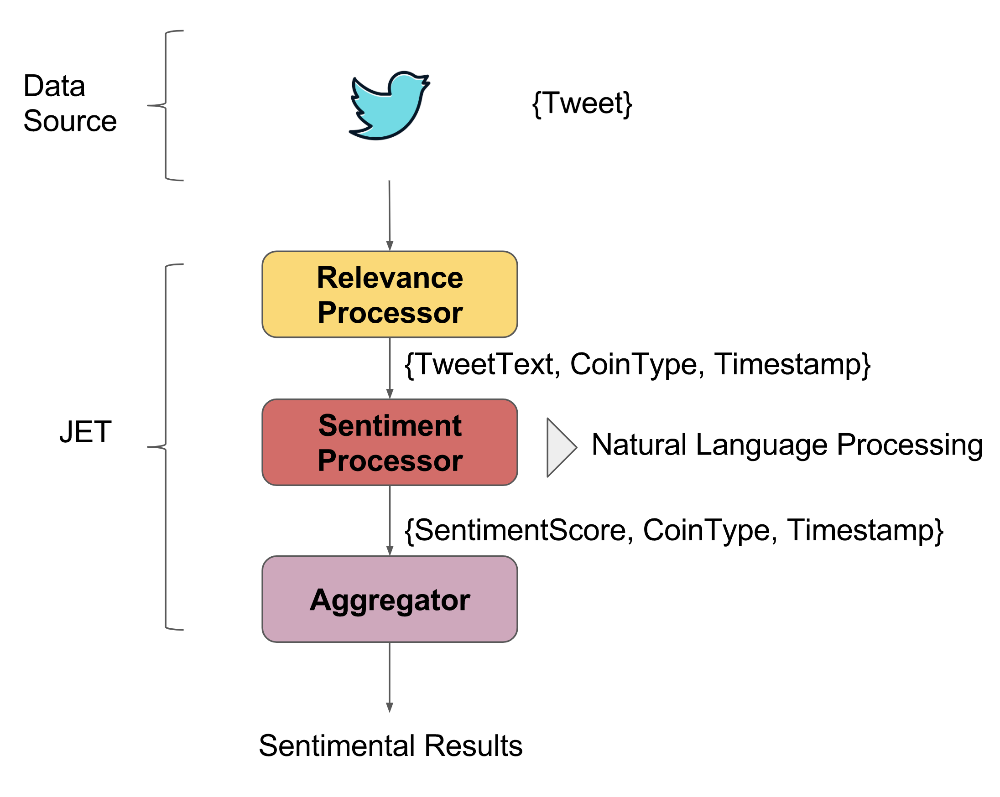

# Cryptocurrency Realtime Trend
Twitter and Reddit content is analyzed in real time to calculate cryptocurrency
trend list with popularity index.

Tweet and post contents are applied NLP sentimental analysis to find to content scores.  



## Prerequisites

You'll need to have API Credentials from Twitter and Reddit to make this demo work.

To obtain them, visit the following websites:
- [Twitter Application Management](http://apps.twitter.com/)
- [Reddit Application Preferences](https://www.reddit.com/prefs/apps)


Please fill in the Twitter and Reddit credentials into these files below.

`src/main/resources/reddit-security.properties`

`src/main/resources/twitter-security.properties`


## Building the Application

To build and package the application, run:

>Please note that maven may take some time to download all dependency on the first run.

```bash
mvn clean package
```

## Running the Application

After building the application, navigate to `target` folder by:
```bash
cd target
```

Then run the application with: 
```bash
mvn exec:java -Dexec.mainClass="JetCoinTrend"
```