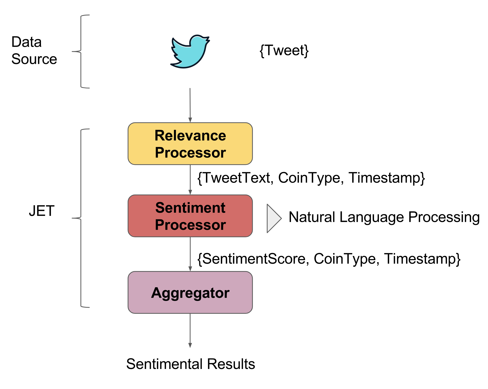
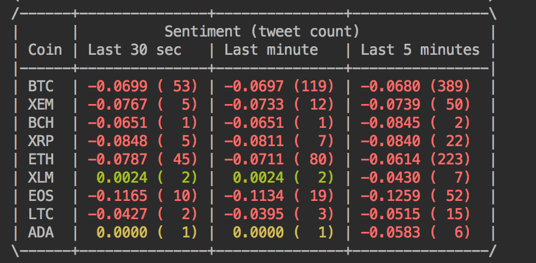

# Twitter Cryptocurrency Sentiment Analysis

This demo takes a live stream of tweets, finds those that talk about 
specific cryptocurrencies, and uses natural language processing to 
determine the overall sentiment of a tweet. It aggregates the 
sentiments into a "popularity index" of each cryptocurrency. 

The demo defines a custom data source that ingests the Twitter stream,
a custom mapping context that accesses a 3rd party NLP library, and
applies rolling aggregation and sliding window aggregation.

## Package Level Structure

- `com.hazelcast.jet.demo` contains the entry point of the demo and the 
  implementation of the computation in Jet's Pipeline API.
- `com.hazelcast.jet.demo.support` contains code common to the Pipeline API
  and Core API implementations. Most notably, the definitions of the 
  cryptocurrencies and an adapter class for the Standford NLP library.

# Data Pipeline



The demo first selects the tweets that mention a cryptocurrency and 
categorizes them by its type (BTC, ETC, XRP, etc). Then it applies the
NLP sentiment analysis to each tweet to calculate the sentiment score of
the respective tweet. This score says whether the Tweet has an overall
positive or negative sentiment. Jet uses Stanford NLP lib to compute it.

For each cryptocurrency, Jet aggregates scores from last 30 seconds, last
minute and last 5 minutes and prints the coin popularity table to the output
like below: 
 

  

## Prerequisites

You'll need to have API Credentials from Twitter to make this demo work.

To obtain them, visit the following website:
- [Twitter Application Management](http://apps.twitter.com/)

Please fill in the Twitter credentials into the file below.

`src/main/resources/twitter-security.properties`


## Building the Application

To build and package the application, run:

```bash
mvn clean package
```

>Please note that maven may take some time to download all dependencies
>on the first run since the NLP libraries are hefty in file size.

## Running the Application

After building the application, run the application with: 

```bash
mvn exec:java
```
