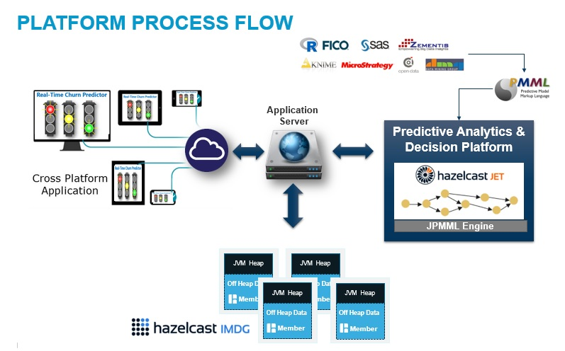
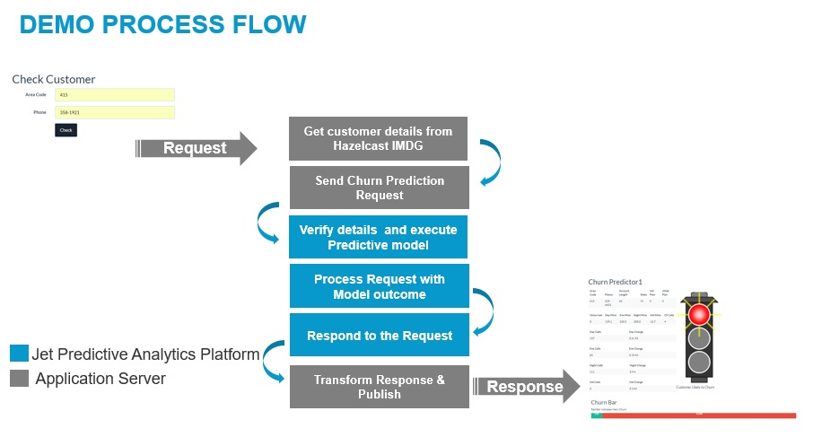

#  Customer Churn Predictor
### This sample has 3 projects 
* **JetScoringEngine**: For scoring requests using already trained PMML Model and responding to appserver with results
* **TelecomCustomerChurnPredictor**: The SpringbootWeb application which serves the UI to enter customer-Dhazelcast.diagnostics.enabled=true phone number to intiate churn prediction. It submits requests to ScoringEngine using Kafka. It loads contract and call details to hazelcast Cluster.
* **ServerMember**: Hazelcast cluster.
*Management center: start MC to monitor cluster.

## Kafka Setup
  1. Install kafka_2.12-0.10.2.1
  2. Start Zookeeper ->    ./zookeeper-server-start.sh ../config/zookeeper.properties
  3. Start Kafka Server -> ./kafka-server-start.sh ../config/server.properties
  4. Create Topics ->  ./kafka-topics.sh --zookeeper localhost:2181 --create --topic t2 --partitions 2 --replication-factor 1
                       ./kafka-topics.sh --zookeeper localhost:2181 --create --topic t1 --partitions 2 --replication-factor 1
   housekeeping 
       rm -rf /tmp/kafka-logs/
       rm -rf /tmp/zookeeper/
                       
 ## Starting the Example
  1. When starting for the first time , edit config.properties in TelecomCustomerChurnPredictor Project and set loadData=true
  2. Start MC (change mc port to something other than 8080) | Start ServerMember     -Dhazelcast.diagnostics.enabled=true com.rlab.hazelcast.ServerMember.ServerMember
  3. Start TelecomCustomerChurnPredictor com.rlab.Application (This will load customer and usage details to cache so it will take few mins)
  4. Start JetScoringEngine com.rlab.jet.JetScoringEngineApplication
  
  ## Demo
  1. Go To http://localhost:8181/churnpredictorMain
  2. In form type phone no: 415  382-4657  Hit Enter to get the prediction result 
  3. Try Phone No: 415-329-6603
  
  ## Process Flow 
  
  
  
  ## Demo Work Flow
  
  
