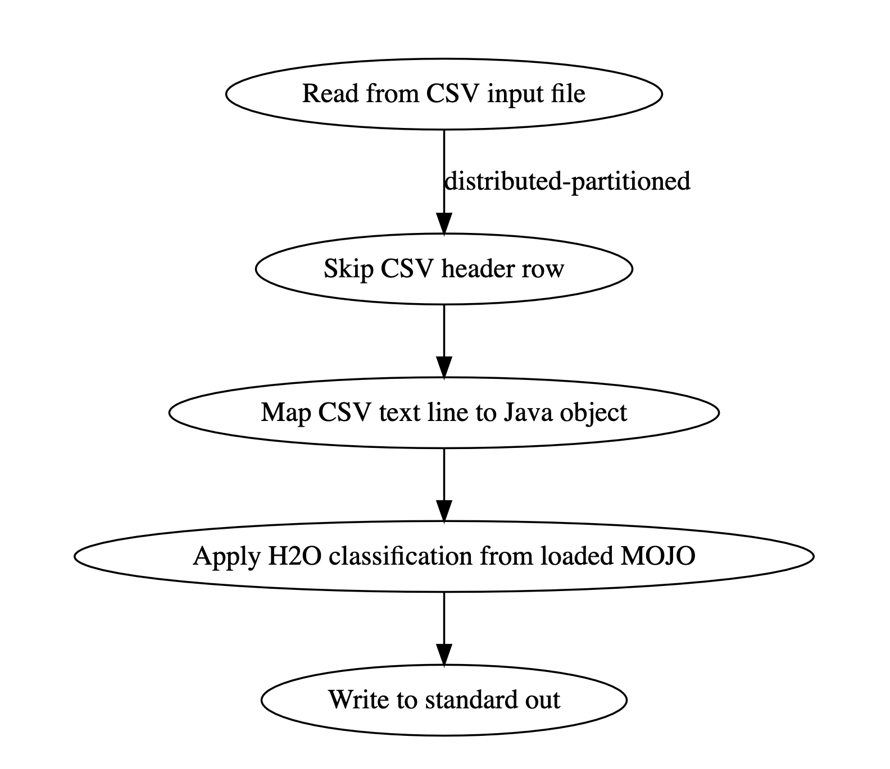

# H2O ML Model Inference with Hazelcast Jet 

[H2O](https://www.h2o.ai) is a leading platform for building, training, and 
executing machine learning data models and algorithms.

[Hazelcast Jet](https://jet.hazelcast.org) is a leading in-memory compute 
platform for high performance stream processing.

This repository is an example of enabling H2O data models for use in real-time 
stream processing by Jet.

In this example we use H2O's [MOJO](http://docs.h2o.ai/h2o/latest-stable/h2o-docs/productionizing.html#about-pojos-and-mojos) 
model type to execute locally in the Jet runtime. We create an H2O Deep Learning 
model, train it with a sample data set [(Breast Cancer Wisconsin (Diagnostic) Data Set)](https://archive.ics.uci.edu/ml/datasets/Breast+Cancer+Wisconsin+(Diagnostic)) 
to prove statistical classification, export the model to a MOJO and 
incorporate the MOJO into a Jet Pipeline.

## Building the MOJO

You will find a pre-built MOJO in the 'model' directory of this repository. 
For further exploration, they Python code used to build the included MOJO is 
found in the 'bin' directory (h2o-generate-model.py). H2O MOJO's are packaged 
in 'zip' format and should be left in this state. It can be unzipped to explore 
the model details if desired.

## Running the Example

Compile the example with Maven:

    $ mvn clean package
    
And then run the Jet job with:

    mvn exec:java
    
This creates a Jet instance and submits the configured job to it. In the setup 
phase, it'll upload the MOJO to all members of cluster then start processing by
loading the validation input file and consuming the records. 

Overall the pipeline looks like below:


Once pipeline started running, observed output should similar to;
```
14:42:23,734 [192.168.99.1]:5701 [jet] [4.0-SNAPSHOT] Match: Actual: BENIGN         Prediction: BENIGN              0.9995171957595149       4.8280424048513374E-4    
14:42:23,734 [192.168.99.1]:5701 [jet] [4.0-SNAPSHOT] Match: Actual: BENIGN         Prediction: BENIGN              0.9998965083134367       1.0349168656326532E-4    
14:42:23,734 [192.168.99.1]:5701 [jet] [4.0-SNAPSHOT] Match: Actual: MALIGNENT      Prediction: MALIGNENT           0.0020640385233223757    0.9979359614766776       
14:42:23,741 [192.168.99.1]:5701 [jet] [4.0-SNAPSHOT] Match: Actual: BENIGN         Prediction: BENIGN              0.9997695625761144       2.304374238856739E-4     
14:42:23,742 [192.168.99.1]:5701 [jet] [4.0-SNAPSHOT] Match: Actual: BENIGN         Prediction: BENIGN              0.9996124104738068       3.8758952619316747E-4    
14:42:23,742 [192.168.99.1]:5701 [jet] [4.0-SNAPSHOT] Match: Actual: MALIGNENT      Prediction: MALIGNENT           2.786613041477759E-4     0.9997213386958522       
14:42:23,742 [192.168.99.1]:5701 [jet] [4.0-SNAPSHOT] Match: Actual: BENIGN         Prediction: BENIGN              0.999792624037609        2.0737596239094044E-4    
14:42:23,742 [192.168.99.1]:5701 [jet] [4.0-SNAPSHOT] Match: Actual: BENIGN         Prediction: BENIGN              0.9996199994381418       3.800005618581977E-4     
14:42:23,742 [192.168.99.1]:5701 [jet] [4.0-SNAPSHOT] Match: Actual: MALIGNENT      Prediction: MALIGNENT           1.8029043066714046E-4    0.9998197095693329       
14:42:23,742 [192.168.99.1]:5701 [jet] [4.0-SNAPSHOT] Match: Actual: MALIGNENT      Prediction: MALIGNENT           9.073219444708513E-4     0.9990926780555291       
14:42:23,742 [192.168.99.1]:5701 [jet] [4.0-SNAPSHOT] Match: Actual: BENIGN         Prediction: BENIGN              0.9998860498475741       1.1395015242591128E-4    
14:42:23,742 [192.168.99.1]:5701 [jet] [4.0-SNAPSHOT] Match: Actual: MALIGNENT      Prediction: MALIGNENT           1.7220707655429823E-4    0.9998277929234457       
```    
This output indicates that Jet is consuming the diagnosis data points, invoking 
the H2O Deep Learning model, and receiving the tumor type prediction.

The diagnosis data point contains the correct type for comparison of the 
prediction. Jet compares the Actual to Predicted types and prints Match or Miss. 
The trailing decimal numbers indicate the models statistical evaluation of the 
data point for each tumor type. 


