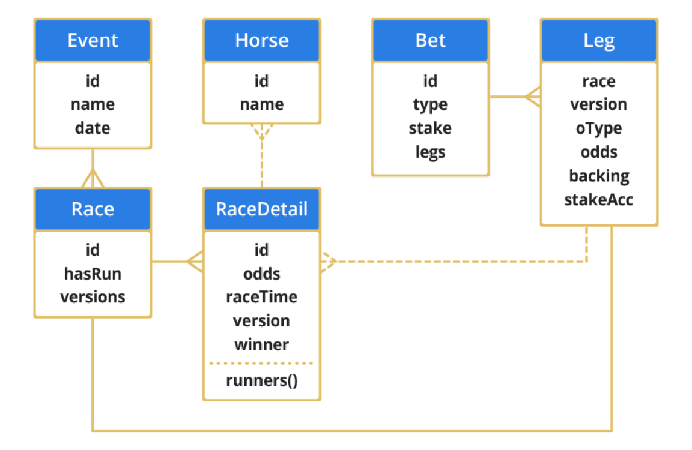

## Getting Started With Hazelcast Jet

In this white paper we examine the new Hazelcast Jet technology.
If you are not already familiar with Hazelcast IMDG, you should start by reading the white paper ["An Architect's View of Hazelcast"](https://hazelcast.com/resources/architects-view-hazelcast/), as we assume a working knowledge of the main features of Hazelcast IMDG throughout.

We will also be looking at JetLeopard, a sample reference application built using Jet.
This is a port to Jet of the BetLeopard application that was introduced in the white paper ["Introduction to Hazelcast IMDG with Apache Spark"](https://hazelcast.com/resources/introduction-hazelcast-imdg-apache-spark/).

To get the most from this white paper it should be read after the previous one, as we assume a familiarity with BetLeopard and its domain model.

### Executive Summary of Hazelcast Jet

Hazelcast Jet is a general purpose distributed streaming data processing engine built on Hazelcast IMDG and based on directed acyclic graphs (DAGs) as a model for data flow.

The project started in 2015 and had its first release in Feb 2017.
It is based on JVM technology, runs on Java 8 and later and is a Java-first technology.

Jet is a processing engine that uses a true streaming model, rather than the batch model.
It is optimized for latency as a primary non-functional characteristic, with throughput being a secondary requirement.

Compared to Hazelcast IMDG, Jet is relatively early in its lifecycle (e.g. it currently only has a Java client API, although others are expected soon).
However, Hazelcast regard it as a technology that is production-ready today and it is fully supported.

It has full integration with Hazelcast IMDG, and also supports the following list of additional sources and sinks:

* HDFS
* Apache Kafka
* Files
* Sockets

This list is expected to grow significantly as the technology matures. 

Release 0.5 is a major milestone for Jet, and the first production ready release. In tests, the underlying engine exhibited no instability and was easy to work with - including being able to write reliable unit tests in single-node operation.

As Jet is intended to be used as a distributed, streaming processing engine, it has all of the core features that are typical for such systems, such as snapshots and fault-tolerance within the processing grid, and windowing of data streams.
This white paper focuses on the core technology and a developer-friendly introduction, and further material should be consulted on the detail of the operation of a production Jet grid.

At its heart, the core technology of Jet is based on a DAG model. 
A DAG is based upon vertices and edges, and in Jet a vertex in the DAG is a group of Processor (aka tasklet) objects in one JVM.
Having a vertex correspond to several processors allows a vertex to be parallelized, even within a single Jet node.
A Processor is best thought of a small piece of simple, "functional Java" code, although this is purely a conceptual description and nothing in the programming model enforces this.

Under the hood, the anticipation is that tasklets are small units of work (understood to be bounded and non-blocking) and that as they are "smaller" than a thread then they can be scheduled in a custom manner without the involvement of the operating system.
Accordingly, tasklets are scheduled on a constrained number of execution threads, just as in other co-operative execution frameworks (such as actors).

The API contains pre-canned methods for standard operations that will be familiar to programmers who already know the functional aspects of Java 8 (e.g. the Java 8 Streams API).
There is also a complete API for building up a custom flow from basic building blocks, should the standard library prove insufficient.

The edges in the DAG model are single producer, single consumer queues.
These are either rendezvous or bounded queues and in both cases back pressure between vertices applies.

The queues are not the standard java.util.concurrent queues and instead use wait-free algorithms and also avoid volatile writes for higher performance.

The end result is that Jet provides several different APIs to the programmer:

* Pipeline
* Distributed java.util.stream
* Core (DAG)

Of the three APIs, the Pipeline API is the newest, and provides a broad feature set and a very easy on-ramp for developers who are new to distributed computing.

The distributed Stream API has additional complexity, compared to running a local application that uses `java.util.stream`.
The API is the same, but under the hood there will always be distributed, partitioned data.

The DAG API has existed for longer, but is not necessary (and is too low-level) for many applications of Jet. For the power user, it provides capabilities not easily accessible by the other APIs and may be useful, e.g. for building DSLs.

A comparison of the APIs can be found on the [Hazelcast website](http://docs.hazelcast.org/docs/jet/0.5.1/manual/Comparison_of_Jet_APIs.html).

In the rest of this white paper, we use the Pipeline API exclusively.

### Introducing JetLeopard

As noted earlier, [JetLeopard](https://github.com/kittylyst/jetleopard) is a port of the BetLeopard open-source betting engine to use Hazelcast Jet.

The JetLeopard

BetLeopard can be [found on Github](https://github.com/hazelcast/betleopard) and models horse-racing.
It was designed as an on-ramp for developers to see a non-trivial model to better illustrate the Hazelcast technologies.
The white paper "Introduction to Hazelcast IMDG with Apache Spark" contains details of the domain model and should be consulted before reading the rest of this white paper.

JetLeopard uses the same domain model as BetLeopard in terms of races, horses, bets and users.

As JetLeopard depends on BetLeopard, we need to arrange the Maven dependency stanzas somewhat carefully, like this:

----
    <properties>
    
        <!-- ... -->
        <!-- Library versions -->

        <!-- ... -->
        <betleopard.version>1.1.0</betleopard.version>
        <hazelcast-jet.version>0.5</hazelcast-jet.version>
    </properties>
    
    <dependencies>
    
        <!-- ... -->
        <dependency>
            <groupId>com</groupId>
            <artifactId>betleopard</artifactId>
            <version>${betleopard.version}</version>
            <exclusions>
                <exclusion>
                    <groupId>com.hazelcast</groupId>
                    <artifactId>hazelcast</artifactId>
                </exclusion>
            </exclusions>
        </dependency>
        <dependency>
            <groupId>com.hazelcast.jet</groupId>
            <artifactId>hazelcast-jet</artifactId>
            <version>${hazelcast-jet.version}</version>
        </dependency>
----

This is because BetLeopard also depends on Hazelcast IMDG and there is a real risk of clashing dependencies.
We want JetLeopard to use Jet's version of Hazelcast IMDG and so we explicitly exclude the dependency from transitively being included from BetLeopard.

With the project set up we can now replicate the historical analysis application from BetLeopard very simply.
JetLeopard is based on the Pipeline API and the warm up calculation is contained in the class AnalysisJet and starts with a very straightforward load of the data into a Hazelcast IMap:

----
    public void setup() {
        jet = Jet.newJetInstance();

        final IMap<String, Event> name2Event = jet.getMap(EVENTS_BY_NAME);
        
        try (BufferedReader r = new BufferedReader(new InputStreamReader(AnalysisJet.class.getResourceAsStream(HISTORICAL), UTF_8))) {
            r.lines().map(l -> JSONSerializable.parse(l, Event::parseBag))
                     .forEach(e -> name2Event.put(e.getName(), e));
        } catch (IOException iox) {
            iox.printStackTrace();
        }
    }
----

With the data loaded into IMDG we can now construct a description of the analysis task.
Unlike the Java 8 APIs, in Jet we construct a single object (a Pipeline) that represents the entire data operation.

The Pipeline is constructed in a declarative way, by using an intermediate class called a ComputeStage.
First, we create an empty Pipeline, and then add an initial data source to it, by using methods such as `drawFrom()` to indicate where objects should be taken from.
These methods return a ComputeStage object, which can then be used as an intermediate object in functional operations.

The ComputeStage is somewhat similar to a Java 8 Stream or a Spark RDD and represents a step in a Jet computation - a node in the DAG representation.
Just as with Java 8 Streams, a DAG calculation needs to be terminated, and Jet provides methods such as `drainTo()` to complete the calculation.
However, unlike Java 8 Streams, in Jet the whole calculation (represented as a DAG) is an object of interest in its own right and can be declared ahead of use and passed around, composed, etc.

As a result, it is considered best practice to use a factory method for the Pipeline and hide any explicit ComputeStage instances inside the method used to construct the overall DAG.

Let's take a look at a simple pipeline for use in the AnalysisJet example:

----
    public static Pipeline buildPipeline() {
        final Pipeline p = Pipeline.create();

        // Compute map server side
        final ComputeStage<Horse> c = p.drawFrom(Sources.map(EVENTS_BY_NAME, t -> true, HORSE_FROM_EVENT));
        
        final ComputeStage<Entry<Horse, Long>> c2 = c.groupBy(wholeItem(), counting())
                .filter(ent -> ent.getValue() > 1);
        
        c2.drainTo(Sinks.map(MULTIPLE));
        
        return p;
    }
----

This pipeline features a source, a sink and one intermediate grouping stage.

The intermediate ComputeStage object, c, is relatively simple, so let's tackle that first. 
It represents a data flow consisting of all major race winners.
This flow is then used in a `groupBy()` construct to accumulate horses together, before filtering the data pipeline to include only multiple winners.

This final data set is then to be drained back into a new IMap in IMDG.

To complete the picture, let's turn to the source generation.
`Sources.map()` takes three parameters:

* A string - the name of the map to source from

* A predicate - a filter for which elements of the map to take

* A projection function - a mapper that takes in elements of the map (as entries) and emits a mapped value

In this case, we are drawing from the EVENTS_BY_NAME and taking everything (using the constant lambda `t -> true`) before doing some data transformation on the way in, via the HORSE_FROM_EVENT helper function.

This function takes in an `Entry<String, Event>` and returns a `Horse`, the winner of the first race of the day, and is defined by a couple of simple static helpers:

----
    public final static Function<Event, Horse> FIRST_PAST_THE_POST = e -> e.getRaces().get(0).getWinner().orElse(Horse.PALE);

    public final static DistributedFunction<Entry<String, Event>, Horse> HORSE_FROM_EVENT = e -> FIRST_PAST_THE_POST.apply(e.getValue());
----

This completes the view of how we have constructed the computation graph (DAG) as a pipeline.

Overall, the Pipeline API is the highest-level API that Jet provides, and this means that when we want to run the job corresponding to the pipeline, it is as simple as a couple of lines of code:

----
    Pipeline p = buildPipeline();
    jet.newJob(p).join();
----

The call to `newJob()` begins executing immediately in an asynchronous manner, and returns a Job object.
This construct holds a simple status and a CompletableFuture on the actual computation - so the job's progress can be queried or cancelled after some time period.

In this simple example, we don't want to do anything asynchronous with the computation and so we call `join()` on the job immediately, and just block for completion.
With this done, Jet has produced the filtered data set for the result, put it into the results IMap and this can then be output in a simple loop like this:

----
    final Map<Horse, Long> multiple = main.jet.getMap(MULTIPLE);
    System.out.println("Result set size: " + multiple.size());
    for (Horse h : multiple.keySet()) {
        System.out.println(h + " : " + multiple.get(h));
    }
----

Given the actual size of the data set under consideration in this example, there is of course no need to involve a distributed framework such as Jet.
However, the clean nature of the Jet API means that the clear construction of the code can be made out regardless of the actual size of the data being processed.

###Porting the live betting calculation to JetLeopard

Let's take the basic Jet concepts from the previous section and see how to apply them to a version of the live betting calculation present in the original BetLeopard.

In the JetLeopard case, Spark and its dependencies (including the entire Scala runtime and quite a few Scala libraries) are no longer needed, which reduces the overall complexity of the stack considerably.
We can also reuse a lot of the boilerplate "random generation" methods that were used in BetLeopard.
As a result, the main loop for JetLeopard is very similar to the BetLeopard case:

----
    public void run() {
        while (!shutdown) {
            addSomeSimulatedBets();
            final Job job = jet.newJob(pipeline);
            job.join();
            outputPossibleLosses();
            try {
                // Simulated delay
                Thread.sleep(20_000);
            } catch (InterruptedException ex) {
                shutdown = true;
            }
        }
        jet.shutdown();
    }
----

In terms of execution then, as before, we use `join()` to force synchronous execution of the Jet job.

The real difference hides in the `pipeline` field on the main application object.
This is, unsurprisingly, set up in a method called `buildPipeline()`, which is slightly more complex than the previous example:

----
    public static Pipeline buildPipeline() {
        final Pipeline pipeline = Pipeline.create();

        // Draw users from the Hazelcast IMDG source
        ComputeStage<User> users = pipeline.drawFrom(Sources.<Long, User, User>map(USER_ID, e -> true, Entry::getValue));
----

Once again, we see the creation of a Pipeline object, which draws data from a Hazelcast IMDG IMap.
The `USER_ID` IMap maps userids to users, and so in this case the projection function needs to simply take the value of each `Entry<Long, User>` object it's handed.
Note that we must provide explicit values for the type parameters on `map()`.
Alternatively, this could also be written:

----
        ComputeStage<User> users =
        	pipeline.drawFrom(
        		Sources.map(USER_ID, e -> true, 
        			Entry<Long, User>::getValue));
----

Now we have a compute stage for all the users, let's use that to build a view of the bets backing each horse, in each race. 
To keep it simple, we'll only consider single bets:

----
        // All bet legs which are single
        ComputeStage<Tuple3<Race, Horse, Bet>> bets = users.flatMap(user -> traverseStream(
                user.getKnownBets().stream()
                    .filter(Bet::single)
                    .flatMap(bet -> bet.getLegs().stream()
                    .map(leg -> tuple3(leg.getRace(), leg.getBacking(), bet)))
            )
        );
----        

There are two aspects of the above code that make it differ slightly from regular Java 8 streams code.
The first is the call to `traverseStream()` - a minor bit of boilerplate to fit stream code into Jet.
The other is the appearance of `Tuple3` - Hazelcast's own implementation of a tuple type containing 3 elements.

Apart from these minor new features, this code should be readable as normal, functionally-styled Java.

To complete the picture, we need to take the compute stage and perform an aggregation upon it.
We achieve this by using a `groupBy()` to produce a compute stage of entry objects.
The key of the entries is the race, and the value is an aggregated map of the possible payouts that would be necessary if each horse was to win:

----
        // Find for each race the projected loss if each horse was to win
        ComputeStage<Entry<Race, Map<Horse, Double>>> betsByRace = bets.groupBy(
                Tuple3::f0, AggregateOperations.toMap(
                        Tuple3::f1,
                        // payout if backed horse was to win
                        t -> t.f2().projectedPayout(t.f1()), 
                        (l, r) -> l + r
                )
        );

        // Write out: (r : (h : losses))
        betsByRace.drainTo(Sinks.map(WORST_ID));

        return pipeline;
    }
----

The key to this is the `AggregateOperations.toMap()` call, which requires three operations to be passed to it:

* A function to produce the map key from an input value

* A function to produce a map value from an input value

* A merge function to combine two mapped values together for the same key

From these three functions, `toMap()` produces the aggregation operation that is used to implement the grouping.

All that's left after that is to drain the resulting maps back into the IMDG instance.

As before, we return the DAG we've built for use at a later time - no actual computation has been performed - we've merely built up a declaration of what we want to have done when the job runs.

Returning to the `run()` method, we can see that after a synchronous execution of the job, the code calls a helper method that calculates largest possible loss and the results that caused that outcome:

----
    public void outputPossibleLosses() {
        final IMap<Race, Map<Horse, Double>> risks = jet.getHazelcastInstance().getMap(WORST_ID);

        final Double apocalypse = risks.entrySet().stream()
                .map(e -> tuple2(e.getKey(), getMaxExposureAsTuple(e.getValue())))
                .sorted((t1, t2) -> t1.f1().f1().compareTo(t2.f1().f1()))
                .limit(20)
                
                // Output "perfect storm" combination of top 20 results that caused the losses
                .peek(t -> System.out.println("Horse: " + t.f1().f0().getName() + " ; Losses: " + t.f1().f1()))
                
                // Finally output the maximum possible loss
                .map(tr -> tr.f1())
                .map(Entry<Horse, Double>::getValue)
                .reduce(0.0, (ra, rb) -> ra + rb);

        System.out.println("Worst case total losses: " + apocalypse);
    }
----

This relies upon a simple static helper that finds the largest exposure that occurs in a map of exposures (e.g. from a single race) and returns a tuple of that horse and the exposed amount.
That is, it represents a "worst case" result for the race (from the point of view of the betting site):

----
    public static final Tuple2<Horse, Double> getMaxExposureAsTuple(Map<Horse, Double> exposures) {
        return exposures.entrySet().stream()
                .max(Entry.comparingByValue())
                .map(e -> tuple2(e.getKey(), e.getValue()))
                .get();
    }
----

This calculation is not especially difficult, but it represents the type of calculations that might be expected to form part of a typical Jet application.

### Comparing Jet's types to Java 8 and Spark

To conclude, let's take a look at some of the similarities and differences between Jet's data model and that of Java 8 Streams and Apache Spark.

All three APIs provide a functionally oriented approach to data processing.
Java 8 streams are, of course, restricted to a single JVM, whereas the other two are designed for large-scale distributed processing.

However, this is not the only difference - and in fact there are two major axes on which Spark and Jet differ from each other.

The first of these is the API tradeoffs inherent in the choice of native language for the API - Java vs Scala.

Why does this distinction matter?

The key underlying point is that the Java Collections is an unashamedly imperative API.
This is entirely by design and represents the prevailing wisdom of the times when the Collections API was added to Java (version 1.2, in 1998).
Unfortunately, at that time, functional programming in Java was not a primary concern, and as a result the API is rather unfriendly for functional code.

Some of the design choices present in the Collections API that make it a less-than-ideal API for functional programming include:

* Many methods mutate a data structure in place, instead of returning a modified copy

* The API of Iterator explicitly mutates internal state and has composite operations

* Implicit assumption that a collection object holds a strong reference to every object in the collection instance

* Java does not have a first class set of types for tuples, and only provides the rather substandard Map.Entry as a nod towards a Tuple2

* The Map type is viewed only as an associative lookup, and not as a set of key-value pairs

Java treats backwards compatibility as a first class virtue, and so the decisions made at the time cannot easily be revised (and some cannot be changes at all).

In this context, one primary goal of Java 8 streams was to offer an alternative API that could be used in a more functional style.
The drawback is that this alternative API is just that - an alternative that is auxiliary to the primary data structures.
The functional aspects are not, and will never be, reflected on the main data structures.

The design of the Scala collections, on the other hand, embraces functional programming as a first-class programming paradigm.
This choice comes at the cost of losing compatibility with Java Collections.

Of the two distributed computing libraries we're considering, Hazelcast Jet makes the design choice to be Java-first.
This provides the advantages of being familiar to Java programmers, at the expense of carrying over some of the boilerplate and API cruft present in Java 8 streams into the Jet API.
Jet also needs to plug some of the holes in the Collections API, e.g. by providing tuple classes and working around the problems caused by Java's view of maps.

Spark has, from its inception, been a firmly Scala-native library, as we discussed in the BetLeopard white paper:

____
Spark, on the other hand, prefers to confront the developer with the fact that they are working with a new abstraction that doesn't fit the Java Collections model.
____

One side-effect of Spark's Scala-first approach is that Java programmers are faced with the necessity of including the Scala runtime and dependencies into their Java projects.
The Scala world does not place the same emphasis on strict binary compatibility that many Java programmers take for granted.
This means that Java-based Spark applications may exhibit occasional stability problems (especially when upgrading or adding to the Scala libraries present in the project dependency graph).

Jet, being a Java-first tech that does not require the Scala runtime, does not suffer from these stability issues, and in the field did not exhibit the sort of runtime linkage failures sometimes seen when working with Spark.
For simple applications, adding Jet to a project can be as simple as "drop in the Jet jar, and if IMDG is already in use, ensure that the version matches the version Jet needs".

The other major axis that distinguishes Spark and Jet can be thought of as whether the implementation is fundamentally based around batches (Spark) or optimized for streamed data (Jet).
From a certain perspective, Spark can be seen as "Hadoop 2.0" that is capable of approximating streaming behaviour over a certain performance domain.
By contrast, Jet's internal architecture is designed for true streaming, with latency as a primary concern rather than raw batch performance.

### Conclusion

With the release of version 0.5 of Hazelcast Jet, it is ready for production use, and is competitive with Apache Spark across a wide set of use cases that Spark covers.
This is positive news for developers, as it improves the available open-source toolkits and provides a range of options for stream processing technology.

The tools are now there, but developers must properly analyse their domain and requirements.
When considering these two technologies for a software project, a lot will depend upon the details of the system under consideration.
The careful architect should ask questions such as:

* How real-time is the real-time computing need?

* What is the teams current skillset?

* What performance requirements are the most important? How well quantified are they?

* How much existing code is there?

* What is the cost of rewriting code to fit to new APIs?

These considerations are essential to understanding the factors that should drive the choice of a streaming technology.
Teams should ensure that they properly understand their own requirements and the trade-offs present with each technology before making their architectural choice.

### Links to additional Hazelcast Jet and IMDG resources

* Learn about Hazelcast IMDG: ["An Architect’s View of Hazelcast" white paper](https://hazelcast.com/resources/architects-view-hazelcast/)

* Download Hazelcast IMDG and [participate in the community](http://www.hazelcast.org)

* Contribute code or report a bug on [GitHub](https://github.com/hazelcast/hazelcast)

* Join the discussion:
  - [Google Groups](https://groups.google.com/forum/#!forum/hazelcast)
  - [StackOverflow](http://stackoverflow.com/questions/tagged/hazelcast)

* Follow us online:
  - [Twitter @Hazelcast](https://twitter.com/hazelcast)
  - [Facebook](https://www.facebook.com/hazelcast/)
  - [LinkedIn](https://www.linkedin.com/company/hazelcast)

