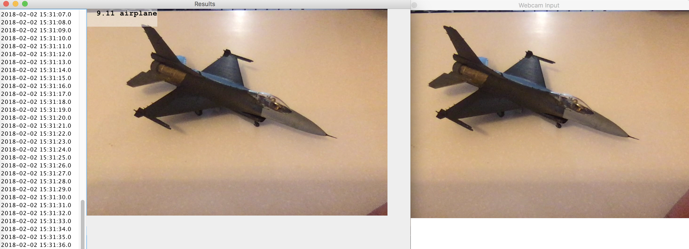

# Real-time Image Recognition
This demonstration application uses the webcam video stream of the laptop computer as a source and recognizes 
the images in each frame.
The recognition done with a model pre-tranied with CIFAR-10 dataset. The model is read from the filesystem and loaded into the Jet processors which are making the recognition.
The recognitions along with recognition scores are aggregated in 1 second windows and 
frame with the maximum score will be shown in a GUI application.

This application shows how you can implement a custom streaming source and sink and how to make streaming aggregations in Hazelast Jet.

## Package Level Structure

The main class (`RealTimeImageRecognition`) with the main method, webcam data source (`WebcamSource`) and serialiable version of the buffered image(`SerializableBufferedImage`) classes resides in the default package.

## Prerequisites

- Git Large File Storage: [Installation Guide](https://git-lfs.github.com/)
  Some of the demo applications includes machine learning models in their use cases. Since some models' size exceeds 
  GitHub's 100MB file storage limit this repository uses Git LFS.
- Java Development Kit 8+: [Installation Guide](https://docs.oracle.com/javase/8/docs/technotes/guides/install/install_overview.html)
- Apache Maven: [Installation Guide](https://maven.apache.org/install.html)

- To make sure you've installed Git Large File Storage and checked out the repository correctly run the following command: 

```bash
$ git lfs ls-files
038574163b - realtime-image-recognition/likevgg_cifar10/model.net
```
You should see an output like above which shows our model is ready to use.

# Building the Application

To build and package the application, run:

```bash
mvn clean package
```

# Running the Application

After building the application, run the application with: 
```bash
mvn exec:java
```

You should be able to see that your webcam input is taken and after a few seconds, outputted to the second GUI with the recognized tag, like below.



Since this is a demonstration application the model is used here is a model pre-trained with [CIFAR-10](https://www.cs.toronto.edu/~kriz/cifar.html). 

The size of the model is around 100MB and contains just 10 categories. 


